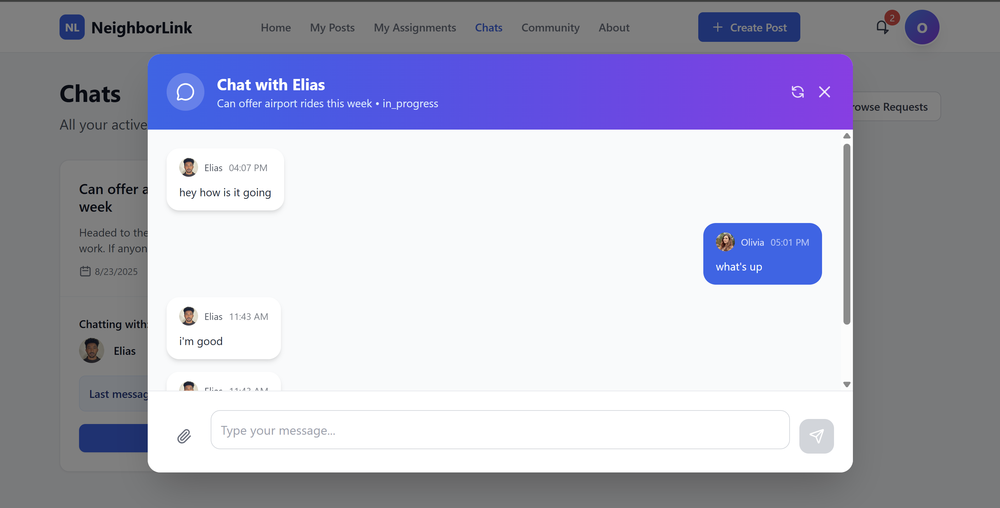
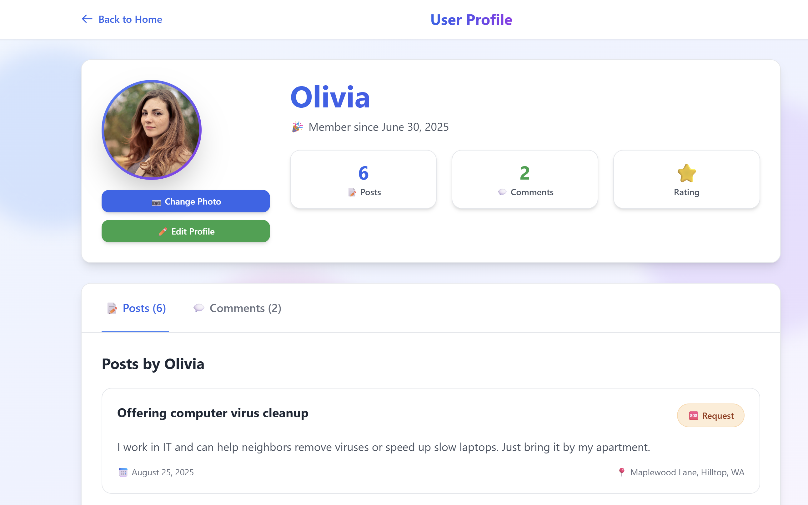
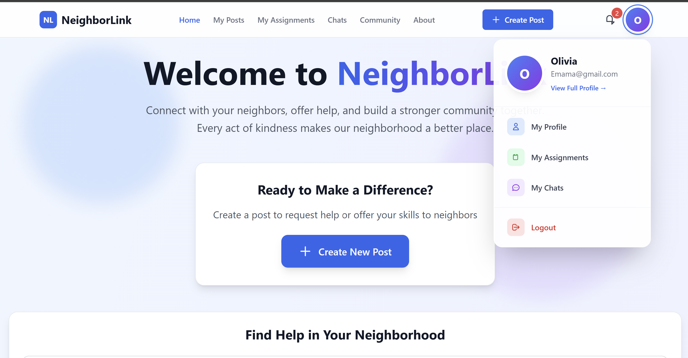

# 🏘️ NeighborLink - Neighborhood Help Platform

A modern, real-time platform that connects neighbors to help each other with daily tasks and build stronger communities.

## ✨ Features

### 🆘 Help Request System
- **Request posts** and **offer posts** with categories and optional location
- Image uploads served from `/uploads`

### 🤝 Assignment Workflow
- Claim requests, owner approves/rejects, track status (Open → In Progress → Completed)

### 💬 Community & Messaging
- Comments on posts (real-time updates)
- User profiles with avatars and basic info
- Socket.IO events for live updates and notifications

### 📱 Modern UI/UX
- React + Tailwind CSS with responsive layouts
- Polished Login and Register screens

## 🚀 Getting Started

### Prerequisites
- Node.js 18+
- MongoDB database
- npm

### Installation

1) Clone and install
```bash
git clone https://github.com/Elias0305Ha/Neighborlink-app.git
cd Neighborlink-app

# Server
cd server && npm install

# Client
cd ../client && npm install
```

2) Environment (server/.env)
```env
MONGO_URI=mongodb://localhost:27017/neighborlink
JWT_SECRET=change_me_in_production
PORT=5000
```

3) Run
```bash
# Terminal 1
cd server
npm run dev   # or: npm start

# Terminal 2
cd client
npm start
```

### Testing
- Client (CRA/Jest):
```bash
npm --prefix client test          # watch mode
npm --prefix client test -- --coverage
npm --prefix client test -- --watchAll=false
```
- Server: no tests configured yet (can add Jest + Supertest on request)

## 🏗️ Architecture

### Backend (Node.js + Express)
- REST API, MongoDB/Mongoose, JWT auth, Socket.IO, Multer uploads
- Static uploads served at `/uploads`

### Frontend (React)
- React Router, stateful views, Socket.IO client, Tailwind CSS

### Data Models
- `User`, `Post`, `Assignment`, `Comment`, `Chat`, `Notification`

## 🔧 API Overview

### Auth
- `POST /api/v1/auth/register` — Register
- `POST /api/v1/auth/login` — Login (returns JWT)
- `GET /api/v1/auth/me` — Current user (requires `Authorization: Bearer <token>`) 

### Posts
- `GET /api/v1/posts` — List
- `POST /api/v1/posts` — Create (auth)
- `GET /api/v1/posts/:id` — Detail
- `PUT /api/v1/posts/:id` — Update (auth/owner)
- `DELETE /api/v1/posts/:id` — Delete (auth/owner)

### Assignments
- `POST /api/v1/assignments` — Claim
- `GET /api/v1/assignments/post/:postId` — For a post
- `PUT /api/v1/assignments/:id/approve` — Approve/Reject
- `PUT /api/v1/assignments/:id/status` — Update status

### Comments
- `GET /api/v1/comments/post/:postId` — List
- `POST /api/v1/comments` — Create
- `DELETE /api/v1/comments/:id` — Delete

### Users, Chats, Notifications
- Routes exist under `/api/v1/users`, `/api/v1/chats`, `/api/v1/notifications`

## 🖼️ Screenshots
- Place your screenshots in `docs/screenshots/` (already added). Embedded examples below:






## 🔒 Notes on Security & Dev
- Use a strong `JWT_SECRET` in production
- Ensure `MONGO_URI` points to your deployed database

## 📦 Production
```bash
# Build client
cd client && npm run build

# Start server (serve API and static uploads)
cd ../server && npm start
```

## 📝 License
MIT — see [LICENSE](LICENSE)

---

Built with ❤️ for stronger neighborhoods